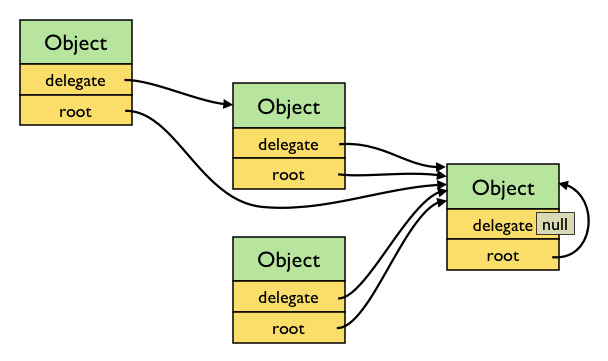
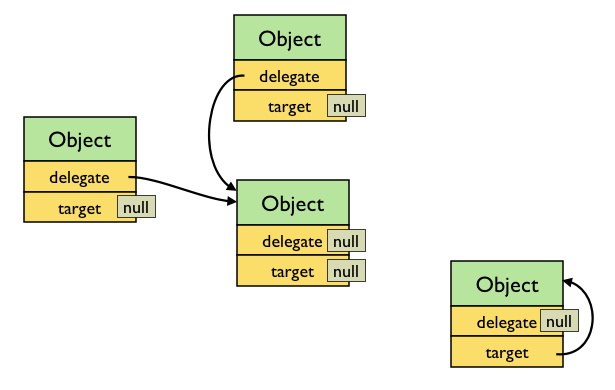
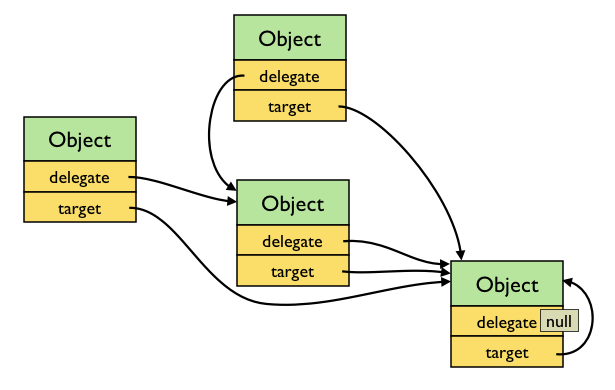

# Руководство. Часть 2. Работа с данными: модели, наборы и значения

[Оглавление](../index.md)

## Введение

В первой части мы расмотрели азы `basis.js`, как строится интерфейс. Но интерфейс обычно не имеет смысла без важного компонента приложения – данных. В этой главе будет рассказано о подходах и механизмах работы с данными, которые предоставляет фреймворк.

## Классы данных

У `basis.js` богатый ассортимент абстракций для хранения данных, их трансформации и различных вычислений. В основном абстракции представлены классами. Не стоит пугаться их количества, большинство классов обычно выполняет одну функцию и используется для определенных задач. Некоторые задачи будут рассмотрены в этой статье.

Все классы делятся на четыре категории, в зависимости от того, как они хранят данные:

* Скаляр (value) – атомарное (неделимое) значение;

* Объект (object) – данные хранятся как ключ-значение;

* Набор (dataset) – неупорядоченное множество объектов, данными является информация о вхождении в это множество;

* Карта (map) – ассоциация произвольного значения с объектом данных.

Независимо от категории классы данных наследуются от `basis.data.AbstractData`, а он в свою очередь – от `basis.event.Emitter`. Последнее означает, что у экземпляров таких классов могут возникать события, и на них можно подписаться. Класс `AbstractData` не описывает способа хранения данных (потому и `Abstract`), но определяет все общее, что присуще любому классу данных. Это такие механизмы, как состояние, подписка и синхронизация. Понять эти механизмы без знания о том, как работают типы данных, достаточно непросто. Потому рассмотрим каждый тип, основные принципы их работы и их вариации.

## Объект (модель)

Под объектом понимается не плоский JavaScript-объект (`plain object`), а специальный интерфейс данных, хранящихся как ключ-значение. Такие классы и экземпляры еще называют моделью (`model`). Это наиболее распространенная абстракция, потому начнем с нее.

Объекты хранят свои данные в поле `data`.

```js
var DataObject = require('basis.data').Object;

var obj = new DataObject({
  data: {
    foo: 1,
    bar: 2
  }
});

console.log(obj.data);
// > Object { foo: 1, bar: 2 }
```

Данные можно поменять в любой момент используя метод `update`. Методу передается объект с теми ключами, которые нужно изменить. Остальные ключи при этом не меняются. Метод `update` сравнивает значения в `data` с переданными значениями, и заменяет старые значения новыми. Если происходят изменения, то метод возвращает дельту – объект, который содержит измененные ключи, со значениями до изменений.

```js
var delta = obj.update({
  foo: 1,
  bar: 3,
  baz: 'Hello, world!'
});
console.log(delta);
// > Object { bar: 2, baz: undefined }

delta = obj.update({
  bar: 3
});
console.log(delta);
// > false
```

Если с данными объекта происходят изменения, то также выбрасывается событие `update`. Независимо от количества изменных ключей событие всегда одно, и оно также содержит дельту изменений (такую же, как вызова метода `update`). Поэтому не сложно следить за изменениями в объекте:

```js
var DataObject = require('basis.data').Object;

var obj = new DataObject({
  data: {
    foo: 1,
    bar: 2
  },
  handler: {
    update: function(sender, delta){
      console.log('data changed:', delta);
      if ('foo' in delta)
        console.log('`foo` changed:', delta.foo, '->', this.data.foo);
    }
  }
});

obj.update({ foo: 'a', bar: 'b' });
// > Object { foo: 1, bar: 2 }
// > `foo` changed: 1 -> 'a'

obj.update({ baz: 'test' });
// > Object { baz: undefined }

obj.update({ foo: 'a' });
// нет изменений – не будет события и сообщений
```

Как можно заметить, ключи и их значения никак не ограничиваются – они могут быть любыми. Это сделано намеренно, чтобы экземпляры этого класса несли основной функционал и были максимально дешевыми (время и память). [xxx] - ссылка на слайд сравнения.

// TODO: про то что data не копируется при создании

Базовый класс объектов (`basis.data.Object`) отлично подходит для простых случаев. Когда нужно больше логики, используется модуль `basis.entity`. Он позволяет создавать типизированные объекты, то есть фиксированный набор ключей и строгий тип значений в `data`. Но об этом мы поговорим позже. А сейчас об одном замечательном паттерне "делегирование".

### Делегирование

Объекты поддерживают механизм делегирования, который позволяет нескольким объектам ссылаться на одни и те же данные. Делается это путем связывания объектов. Мы говорим, что объект делегирует данные другого объекта (делегат). В этом случае объект хранит ссылку на объект-делегат в свойстве `delegate`. Меняется делегат методом `setDelegate`.

```js
var DataObject = require('basis.data').Object;

var foo = new DataObject({ data: { foo: 1 } });
var bar = new DataObject({ data: { bar: 2 } });

console.log(foo.data);
// > Object { foo: 1 }
console.log(bar.data);
// > Object { bar: 2 }


foo.setDelegate(bar);
console.log(foo.data);
// > Object { bar: 2 }
console.log(foo.data === bar.data);
// > true
console.log(foo.delegate === bar);
// > true
```

Сбросить делегат можно, вызвав метод без аргументов.
При этом у объекта `foo` останется изолированная копия `data`. Подробнее [в документации](basis.data.Object.md#Делегирование).

```js
// FIXME describe delegate reset at the end
foo.setDelegate()
console.log(foo.data);
// > Object { bar: 2 }
console.log(foo.delegate);
// null
foo.update({ qux: 4 })
console.log(bar.data)
// Object {bar: 2}
console.log(foo.data)
// Object {bar: 2, qux: 4}
```

Так как оба объекта ссылаются на одни и те же данные, то становится неважным, у кого из них вызывать метод `update`, чтобы изменить данные. Если вызов метода `update` приводит к изменениям, событие `update` будет выброшено для обоих объектов.

```js
foo.addHandler({
  update: function(sender, delta){
    console.log('foo data changed:', delta);
  }
});
bar.addHandler({
  update: function(sender, delta){
    console.log('bar data changed:', delta);
  }
});

foo.update({ bar: 'change foo' });
// > bar data changed: Object { bar: 2 }
// > foo data changed: Object { bar: 2 }

bar.update({ bar: 'change bar' });
// > bar data changed: Object { bar: 'change foo' }
// > foo data changed: Object { bar: 'change foo' }
```

Логично предположить, что таким образом можно связать произвольное количество объектов. В результате получается граф, а точнее дерево, так как циклы исключены. Единственный объект, не имеющий делегата (свойство `delegate` равно `null`), является корнем, и все объекты имееют на него ссылку в свойстве `root`. А когда у объекта нет делегата, свойство `root` ссылается на самого себя.

```js
console.log(foo.root === bar);
// > true
console.log(bar.root === bar);
// > true
```



Как ни удивительно, но обычно в таких графах большинство объектов изначально планируются быть прокси-объектами, а не источниками данных (к ответу на вопрос, почему так происходит, мы подойдем совсем скоро). Поэтому была введена еще одна важная роль в графе – целевой объект. Такая роль назначается объектам, которые являются источниками данных. При этом, такие объекты не могут иметь делегатов, так как в этом случае, данные будут утеряны. Факт того, что объект является целевым определяет значение свойства `target`. Если оно ссылается на сам объект – то этот объект является целевым. В противном случае, свойство равно `null` или ссылается на целевой объект, если такой объект имеется в графе, по тому же принципу, что и `root`. Чтобы сделать объект целевым, нужно указать `target: true` при его создании или указать это в прототипе класса унаследованного от `basis.data.Object`.




```js
console.log(foo.target);
// > null
console.log(bar.target);
// > null

var baz = new DataObject({
  target: true
});
bar.setDelegate(baz);

console.log(baz.target === baz);
// > true
console.log(foo.target === baz);
// > true
console.log(bar.target === baz);
// > true
```

Свойства `root` и `target` меняются автоматически. При этом выбрасываются события `rootChanged` и `targetChanged`, которые получают предыдущее значение свойства (до изменения). Когда меняется `delegate` по аналогии выбрасывается событие `delegateChanged`. Кроме того, для всех трех свойств поддерживается `listen`, так что можно удобно добавлять обработчики на соответствующие объекты.

```js
var DataObject = require('basis.data').Object;

var foo = new DataObject();
var bar = new DataObject({
  delegate: foo,
});
var baz = new DataObject({
  hander: {
    delegateChanged: function(sender, oldDelegate){
      console.log('delegate changed:', oldDelegate, '->', this.delegate);
    }
  },
  listen: {
    root: { // автоматически делает this.root.addHandler(..) и
            // this.root.removeHandler(..) при изменении root
      activeChanged: function(){
        console.log('root active changed');
      }
    }
  }
});

baz.setDelegate(bar);
// > delegate changed: null -> basis.data.Object { .. }
foo.setActive(true);
// > root active changed
baz.setDelegate();
// > delegate changed: basis.data.Object { .. } -> null
foo.setActive(false);
// в консоли ничего не будет
```

### Родство с basis.ui.Node

## Состояние

Понятие состояния является очень важным, определяет состояние данных и то, что с ними происходит. Значение состояния хранится в поле `state`.
